# TCC

## Resumo

Neste trabalho de conclusão de curso, aplicam-se conceitos de IA (inteligência artificial) no desenvolvimento de um sistema automatizado de tabuleiro de xadrez. Utilizando visão computacional e aprendizado de máquina, o sistema é capaz de reconhecer peças e calcular jogadas ideais. O tabuleiro identifica as peças por meio de reconhecimento de imagem, calcula as jogadas com a *engine* Stockfish, processa em Python e envia comandos ao microcontrolador responsável pelo controle das luzes nas casas de xadrez, comunicando-se assim com o jogador. Treinado e validado o modelo de IA, obtém-se precisão média de 99,07 \%. O projeto integra hardware e software, permitindo a realização de partidas completas de xadrez entre humano e máquina, sem necessidade de telas digitais. 

Inteligência Artificial,
Visão Computacional,
Aprendizado de Máquina,
Redes Neurais Convolucionais,
Automação de Xadrez

## Introdução

A visão computacional surgiu no final da década de 1950, como parte das pesquisas em IA, visando dotar as máquinas da capacidade de interpretar o ambiente ao seu redor, processando informações visuais na tentativa de imitar a visão humana . Mediante experimentos iniciais no reconhecimento de formas geométricas, a visão computacional avançou, e na década de 1950 o desenvolvimento de OCR (*Optical Character Recognition*, ou Reconhecimento Óptico de Caracteres) abriu espaço para as primeiras aplicações comerciais, como a leitura de textos, sendo um suporte útil em diversas áreas, inclusive para pessoas com deficiência visual . Limitado pelo poder de processamento das máquinas, o avanço dos computadores e o desenvolvimento de novas tecnologias de hardware e algoritmos, permitiram o surgimento de ferramentas mais poderosas, como o OpenCV, lançado pela Intel em 1999, popularizando a visão computacional . O que se expandiu além do meio acadêmico, alcançou as indústrias e hoje permite inspeções de qualidade, análise em tempo real e detecção de falhas em processos automatizados .

Atualmente, ferramentas de identificação visual permitem que máquinas interpretem o ambiente, agindo como sensores capazes de gerar informações úteis, previamente mapeadas, a partir de imagens de treinamento. No contexto industrial, essa possibilidade abre novos horizontes, complementando sensores tradicionais, como os de luz ou de presença . Funcionando como um sensor integrado, com capacidade de gestão e organização semelhantes à visão humana, é responsável pela percepção de movimentos, distorções de padrões e diagnósticos da situação ao redor, agregando valor ao permitir que máquinas façam previsões e tomem decisões com base em histórico de dados, de forma independente. Aplicável a diversos setores, essa tecnologia é usada principalmente em processos mais tecnológicos devido à mão de obra especializada que requer .

Conceituando a visão computacional, esse termo refere-se a um software capaz de interpretar e gerar informações com base em imagens ou vídeos. Tal conceito está relacionado à IA, uma vez que a máquina precisa fazer inferências com base em imagens, sendo possível interpretar e comparar píxel a píxel, estabelecendo padrões entre as imagens . Essa capacidade é fundamental para tarefas como a detecção de anomalias, nas quais o sistema pode identificar imagens fora do padrão, como, por exemplo, uma peça virada na linha de produção . Isso é possível por meio de um banco de dados com o qual a IA foi treinada, na maioria das vezes manualmente, ensinando quais imagens do banco de dados correspondem a quais informações. A partir do processamento desses dados através do aprendizado profundo (*deep learning*), é possível condensar o conhecimento em uma ferramenta capaz de identificar rapidamente e realizar inferências com base em imagens .

Na indústria, a robótica e a manipulação de peças beneficiam-se de sistemas de visão 3D, focados no reconhecimento de formas geométricas, permitindo identificar e posicionar objetos em ambientes de produção . No controle de qualidade, os benefícios se traduzem na identificação de peças não conformes, reduzindo intervenções manuais, pois elimina a necessidade de monitoramento constante por operadores humanos, uma vez que opera de forma ininterrupta. Em áreas documentais e na organização de catálogos ou no recebimento de mercadorias, o OCR consegue automatizar fluxos de trabalho, conectando textos não digitais com ações na linha de produção e até mesmo fluxos no sistema empresarial .

A proposta deste trabalho de conclusão de curso é um sistema com visão computacional, capaz de reconhecer peças de xadrez e realizar jogadas com um usuário, utilizando aprendizado de máquina para detectar as peças e, com base nas posições, calcular jogadas. O objetivo de usar essas técnicas é lidar com variações no ambiente, como mudanças de iluminação e ângulos de visualização, bem como interferências no tabuleiro, evitando que anéis ou outros objetos que não correspondem às peças se tornem falsos positivos. Dessa forma, oferece uma solução robusta para a automação de jogos de tabuleiro e pode ser aplicável a outros cenários, como em uma esteira de peças onde o operador as manuseia, permitindo ao sistema identificar quais peças estão em conformidade, sem sobrecarregar ou onerar o trabalhador na linha de produção.

Dentro desse contexto, o tabuleiro de xadrez automatizado foi desenvolvido como uma prova de conceito. O objetivo principal deste projeto é demonstrar o uso de aprendizado de máquina (do inglês, *machine learning*) em um ambiente dinâmico, de forma prática e experimentalmente eficaz. Para atingir esse objetivo, foi separado em objetivos específicos:

     Construir o tabuleiro utilizando uma base de acrílico e MDF, equipado com luzes para sinalização de cada casa, representando os movimentos das peças.
     Acionar as luzes por meio de um microcontrolador, indicando as jogadas calculadas.
     Posicionar uma câmera acima do tabuleiro para captar imagens das jogadas realizadas.
     Utilizar um software de IA treinado em redes neurais para analisar as imagens e reconhecer a posição das peças de Xadrez.
     Integrar a *engine* StockFish para realizar cálculos e validar as jogadas em resposta aos movimentos do jogador.
     Implementar a comunicação entre o modelo de IA e o tabuleiro, permitindo a sinalização das jogadas da máquina.
     Realizar testes para verificar a precisão e a confiabilidade do sistema.
     Demonstrar a eficácia de redes neurais e visão computacional neste projeto, evidenciando sua aplicação em cenários complexos e dinâmicos.

Este trabalho está estruturado em seções: na Seção II, é realizada uma revisão bibliográfica. Em seguida, a Seção III detalha a estrutura e configuração dos componentes do sistema e apresenta o protótipo do sistema, assim como a análise dos resultados. A Seção IV apresenta a execução prática do projeto, seguida pelas conclusões finais na Seção V.

## Fundamentação Teórica

Nesta seção, apresenta-se uma revisão dos principais conceitos e tecnologias que sustentam o desenvolvimento de sistemas de visão computacional aplicados ao reconhecimento e interação com objetos, dentro do contexto de uma partida de xadrez.

### Xadrez

O xadrez tem sido um campo de estudo importante para a IA desde a criação de algoritmos básicos nos anos 1950, culminando na vitória do Deep Blue sobre Garry Kasparov em 1997 . Este marco evidenciou como a evolução dos algoritmos especializados, aliada à capacidade de realizar cálculos massivos, permitiu que uma máquina superasse um ser humano em um jogo de estratégia altamente complexo. Atualmente, abordagens como aprendizado profundo e redes neurais convolucionais, descritas por Goodfellow et al., são amplamente utilizadas para enfrentar desafios de reconhecimento e tomada de decisão no xadrez automatizado .

Pesquisas como as de Czyzewski e Indreswaran aplicam aprendizado de máquina para identificar peças no tabuleiro e classificar posições. Esses trabalhos empregam algoritmos como CNNs, que Krizhevsky descreve como fundamentais para detecção e classificação de padrões visuais. Além disso, ferramentas como OpenCV, destacadas por Rosebrock, são essenciais para integrar visão computacional a sistemas automatizados .

### Redes Neurais Convolucionais

Redes neurais convolucionais, do inglês *convolutional neural networks*, são uma arquitetura especializada de redes neurais projetada para processar dados que possuem uma estrutura de grade, como imagens. Diferentemente das redes neurais tradicionais, as CNNs utilizam camadas de convolução para processar informações espaciais, utilizando os píxeis de uma imagem. Essas camadas aplicam filtros que destacam características importantes, como bordas, texturas e formas, em diferentes níveis de abstração. De acordo com Krizhevsky, as CNNs foram fundamentais para o avanço em tarefas como classificação de imagens e detecção de objetos .

As CNNs fazem parte do conceito abrangente de IA, explicado por Goodfellow et al., que destaca a relação interdependente entre as camadas de IA, abrangendo métodos e técnicas destinadas a criar sistemas inteligentes . A Figura  apresenta um diagrama de Venn que ilustra como o aprendizado profundo é um tipo de aprendizado de representação (*Representation Learning*), que, por sua vez, é um tipo de aprendizado de máquina (*Machine Learning*), sendo este utilizado para muitas, mas não todas, as abordagens de IA. Cada seção do diagrama contém um exemplo de tecnologia de IA:

     **Inteligência Artificial**: Abrange métodos e técnicas destinadas a criar sistemas inteligentes. É a área mais ampla que engloba as demais subáreas.
     **Aprendizado de Máquina**: Constitui um subconjunto da IA que utiliza algoritmos para permitir que os sistemas aprendam diretamente a partir de dados, sem a necessidade de programação explícita para cada tarefa.
     **Aprendizado de Representação**: É uma subárea do aprendizado de máquina que busca identificar representações úteis dos dados, facilitando o aprendizado ao tornar os modelos mais eficientes e robustos.
     **Aprendizado Profundo**: É uma técnica específica de aprendizado de representação baseada em redes neurais profundas, permitindo modelar dados complexos por meio de várias camadas hierárquicas.

    

Dentro do que tange IA, a estrutura característica de uma CNN é composta por camadas convolucionais, de *pooling*, conectadas e camadas de ativação. A camada convolucional aplica filtros para extrair características específicas de uma imagem, enquanto a camada de pooling reduz a dimensionalidade, preservando informações essenciais e melhorando a eficiência computacional. Já as camadas totalmente conectadas e de ativação são responsáveis por classificar as informações extraídas em categorias predefinidas. Goodfellow, Bengio e Courville definem a convolução: "A convolução é uma operação matemática que permite a extração de características locais, enquanto o pooling reduz a dimensionalidade dos mapas de características, tornando as representações compactas e robustas às variações nos dados de entrada" .

A convolução é utilizada para extrair características locais de dados de entrada, como imagens. Consiste na aplicação de um filtro (ou *kernel*), que é uma pequena matriz de pesos treináveis, que percorre a grade da imagem com um determinado passo (*stride*). Em cada posição, realiza-se uma multiplicação ponto a ponto entre os valores do filtro e os da entrada, seguida de uma soma dos resultados, produzindo um mapa de características que destaca padrões específicos, como bordas, texturas ou formas.

Enquanto o pooling visa comprimir as características de cada setor da grade da imagem, mantendo as informações mais relevantes. As formas comuns de pooling são o max pooling, que seleciona o valor máximo em uma região específica, e o average pooling, que calcula a média dos valores nessa região. Ao aplicar o pooling, a rede se torna robusta a variações e deslocamentos na posição dos objetos, além de diminuir a complexidade computacional e o filtrar ruídos que tornam lento o modelo da IA.

Tais processos de redes neurais se consolidam no modelo da IA, uma representação matemática, computacional e comprimida. O modelo é treinado utilizando algoritmos específicos e conjuntos de dados relevantes, ajustando seus parâmetros internos para otimizar o desempenho, receber imagens e responder com maior velocidade ao qual foi treinado. 

Por exemplo, ao processar uma imagem de um tabuleiro de xadrez, as camadas iniciais de uma CNN podem identificar bordas e formas das peças, enquanto as camadas mais profundas reconhecem o tipo específico de cada peça, mesmo sob condições variáveis, como iluminação ou ângulos de visão diferentes.

Combinadas com técnicas modernas como transfer learning, as CNNs permitem que modelos pré-treinados sejam adaptados para novas tarefas com conjuntos de dados menores, como sugerido por Géron . Essa abordagem reduz significativamente o tempo de desenvolvimento e melhora a precisão do reconhecimento, tornando-a ideal para aplicações práticas, como o projeto de tabuleiros automatizados.

### Visão Computacional

A visão computacional é definido por Richard Szeliski, como um sistema automatizado capaz de compreender e extrair informações úteis de cenas visuais . Teve seu desenvolvimento impulsionado por pesquisas que buscavam dotar máquinas da capacidade de interpretar e processar informações visuais. Desde os primeiros experimentos de reconhecimento de formas nos anos 1950 e com o surgimento do reconhecimento óptico de caracteres na década de 1970, essa tecnologia consolidou-se como uma ferramenta fundamental para a automação industrial. Com o avanço da capacidade de hardware e processamento e o desenvolvimento de bibliotecas *open-source* como o OpenCV, a visão computacional se difundiu para aplicações industriais, tornando-se facilitadora na inspeção de qualidade, análise em tempo real e detecção de falhas . 

Com o avanço do aprendizado profundo, a visão computacional evoluiu significativamente, substituindo abordagens baseadas em algoritmos matemáticos, por modelos de IA treinados para reconhecer padrões complexos. Utilizando ferramentas modernas como CNNs e algoritmos especializados, como o YOLO (*You Only Look Once*), revolucionando o campo. Esses modelos aprendem a identificar características relevantes diretamente a partir dos dados, eliminando a necessidade de programação explícita para cada tarefa, como observado por Goodfellow et al. .

### Algoritmos de Detecção de Objetos

YOLO, abreviação para *You Only Look Once*, é um dos algoritmos de detecção de objetos desenvolvido por REDMON et al. . Ele se diferencia de outras abordagens, pois trata a detecção como um único problema de regressão, analisando toda a imagem em um único passo para identificar objetos e suas localizações. O método divide a imagem em uma grade, onde cada célula prevê possíveis objetos e suas posições. Segundo o desenvolvedor, essa abordagem permite realizar detecções em tempo real com altas taxas de quadros por segundo, equilibrando desempenho computacional e precisão. Ele pode identificar peças de xadrez, mesmo em condições adversas, como iluminação variável ou peças parcialmente obstruídas.

Outros algoritmos de detecção de objetos competem em precisão e velocidade, como o algoritmo de duas etapas, Faster R-CNN, priorizam a precisão ao usar redes de propostas regionais, mas apresentam maior custo computacional . Em contrapartida, métodos de uma etapa, como SSD e RetinaNet, oferecem um equilíbrio entre rapidez e precisão, sendo adequados para aplicações em tempo limitado . Algoritmos mais recentes, como DETR, utilizam correspondência bipartida e uma arquitetura de codificador-decodificador de transformador, mas ainda requerem alto poder computacional .

Para utilizar o YOLO, e criar um dataset para treinamento, existe a plataforma do Roboflow. Ele permite anotar, pré-processar e exportar dados otimizados para uso em modelos de aprendizado profundo, como o YOLO. Como apontado por estudos recentes, o uso de plataformas como o Roboflow simplifica tarefas como *data augmentation* e particionamento de dados para treinamento e validação, reduzindo significativamente o tempo necessário para desenvolvimento e teste .

### Motores de Xadrez

Motor de xadrez, ou *chess engine*, são softwares projetados para analisar e jogar xadrez em níveis superiores ao humano, como o Stockfish *engine*. Desde o marco histórico do *Deep Blue* contra Kasparov em 1997, esses motores evoluíram significativamente, incorporando técnicas como busca alfa-beta e redes neurais para otimizar suas análises . Stockfish foi lançado em 2008, utilizando algoritmos de força bruta e aprendizado profundo para calcular milhões de posições por segundo, tornando-se referência em competições e uma ferramenta essencial em estudos acadêmicos e práticos.

O Stockfish é capaz de verificar jogadas do usuário e calcular a melhor resposta àquela jogada. No trabalho de Neves Filho, é proposta uma arquitetura de sistema robótico para a prática e ensino do xadrez, na qual a integração de um motor de xadrez é fundamental para a tomada de decisões e validação das jogadas . 

### Matriz de LEDs

A utilização de LEDs (*Light Emitting Diodes*) como meio de comunicação visual em sistemas interativos é corriqueira na interface homem-máquina (IHM). Os LEDs são componentes eletrônicos que emitem luz quando uma corrente elétrica passa por eles. Eles operam com base no princípio da emissão de luz por recombinação de elétrons, onde uma corrente elétrica causa a migração de elétrons de uma banda de energia mais alta para uma mais baixa, liberando energia na forma de luz visível. Sua polaridade é definida, o que significa que eles só conduzem corrente em uma direção, com o terminal positivo (ânodo) conectado ao VCC e o negativo (cátodo) ao GND.

Ao usar uma matriz de LEDs, são utilizados circuitos integrados conhecidos como *shift-registers* (como o 74HC595). Os *shift-registers* funcionam como conversores serial-paralelo, permitindo que o microcontrolador envie dados de controle em formato serial para serem distribuídos em múltiplas saídas paralelas, reduzindo o número de pinos necessários para o acionamento dos LEDs. Essa abordagem é eficiente em sistemas de automação, especialmente quando os recursos de hardware são limitados.

### Raspberry Pi

O Raspberry Pi é um computador de placa única (Single Board Computer - SBC) amplamente utilizado em projetos de automação e prototipagem devido à sua versatilidade, baixo custo e integração de hardware e software. Com processadores ARM, GPIOs configuráveis e suporte para sistemas operacionais baseados em Linux, ele possibilita a execução de diversas tarefas.

O Raspberry Pi possui um microprocessador central que executa instruções do sistema operacional e controla dispositivos periféricos conectados a ele. A interação com o hardware externo ocorre por meio das GPIOs (*General Purpose Input/Output*), que podem ser configuradas como entradas ou saídas digitais. Além disso, sua compatibilidade com protocolos de comunicação serial, como I2C, SPI e UART, permite a integração eficiente com componentes eletrônicos, incluindo *shift-registers* e câmeras, facilitando a troca de dados em tempo real. Operando sobre distribuições Linux, como o Raspberry Pi OS, o dispositivo se beneficia de bibliotecas dedicadas, como a RPi.GPIO, simplificando a configuração e o controle dos pinos.

### Arduino

O Arduino refere-se a uma plataforma de desenvolvimento embarcado que compreende tanto o hardware (placa com microcontrolador e circuitos de suporte) quanto o software (IDE, bibliotecas e ferramentas de compilação). A placa Arduino contém um microcontrolador AVR — como o ATmega328P ou ATmega2560 — que executa instruções compiladas diretamente, sem necessidade de sistema operacional. O ambiente de desenvolvimento Arduino abstrai a complexidade de acesso a registradores internos por meio de bibliotecas centrais (Arduino Core), permitindo o controle de pinos digitais, sinais PWM, comunicação UART, leitura analógica e timers. O código escrito em C/C++ é convertido em binário por meio do compilador *avr-gcc* e carregado no microcontrolador via bootloader ou conexão ICSP . Essa arquitetura simples e direta torna o Arduino adequado para aplicações embarcadas que exigem resposta em tempo real, como automação de sensores, controle de atuadores, robótica básica e instrumentação científica. Sua ampla documentação, comunidade ativa e baixo custo também consolidam seu uso no meio acadêmico .

O Arduino é baseado em microcontroladores, operando em modo *bare-metal*, ou seja, executa diretamente um programa binário no hardware, sem sistema operacional intermediário. Essa abordagem resulta em menor consumo de energia, menor latência e maior previsibilidade em tarefas de tempo real. O custo das placas varia entre R\$ 65 e R\$ 150, a depender do modelo, como Uno ou Mega. A versão Mega 2560, por exemplo, dispõe de 54 pinos digitais e 16 entradas analógicas, configuráveis via software ou diretamente por meio de registradores. Os protocolos de comunicação I2C, SPI, UART e PWM são amplamente suportados para integração com sensores, módulos e atuadores . A modularidade da plataforma é ampliada pelo uso de shields (extensões de hardware), que permitem adicionar funcionalidades como controle de motores, conexão ethernet ou leitura de cartões SD . No entanto, o Arduino apresenta limitações em termos de conectividade, armazenamento e processamento intensivo, sendo popularmente utilizado com conexões USB ou comunicação serial.

### Trabalhos relacionados

Ao pesquisar estudos e tecnologias correlatas com projeto, motores de xadrez e IA, revela-se um progresso significativo no desenvolvimento de sistemas autônomos e interativos para análise e jogabilidade. O trabalho de Neves Filho destaca a integração de motores como Stockfish em sistemas robóticos para o ensino e prática do xadrez, demonstrando o interesse em combinar IA com dispositivos físicos . Menezes amplia essa abordagem com o ChessPy, uma ferramenta para detecção de peças que utiliza técnicas de visão computacional e aprendizado de máquina, facilitando a interação homem-máquina em contextos de xadrez automatizado . Em um estudo, Indreswaran explora a aplicação de aprendizado de máquina para reconhecer peças de xadrez, destacando o papel das CNNs no aumento da precisão . Complementando esses avanços, Czyzewski et al. utilizam redes neurais para o reconhecimento de tabuleiros e peças, integrando modelos computacionais modernos em sistemas interativos . Essas referências consolidam a base tecnológica para sistemas de xadrez automatizado, ressaltando a evolução de soluções robustas para aplicações práticas.

A visão computacional e o aprendizado profundo são exploradas por Szeliski, enquanto Goodfellow et al. destacam redes neurais profundas . O YOLO, apresentado por Redmon et al., revolucionou a detecção de objetos em tempo real . Ferramentas como o OpenCV, descritas por Rosebrock, facilitam a integração prática do aprendizado profundo em dispositivos acessíveis, combinando captura visual, processamento e resposta interativa .

A integração entre hardware e software é essencial para sistemas autônomos, especialmente em aplicações como o reconhecimento de peças de xadrez. Conforme Pajankar, o Raspberry Pi oferece uma plataforma versátil que combina processamento local com conectividade, facilitando a interface com dispositivos como matrizes de LEDs e câmeras . Neves Filho destaca seu uso na comunicação entre hardware e motores de xadrez, enquanto Steinheiser ressalta sua importância para garantir precisão em sistemas de detecção de padrões . Além disso, exemplos práticos apresentados pela *Packt Publishing* demonstram como o aprendizado profundo pode ser integrado eficientemente ao Raspberry Pi, reforçando sua aplicabilidade em soluções escaláveis e robustas .

Dentre os trabalhos relacionados ao xadrez automatizado destacam-se: Rosa (2024), ao desenvolver um aplicativo que identifica lances de xadrez por meio de processamento de imagens, enquanto Menezes e Maia (2023) apresentaram uma ferramenta que combina CNNs com hardware eficiente para detecção precisa de peças . Silva (2023) explorou técnicas de *ensemble* para otimizar a classificação de dados, e Soykan (2021) demonstrou como CNNs podem ser aplicadas à classificação de imagens de peças de xadrez, aprimorando a precisão e eficiência de sistemas automatizados .

No mercado atual, existem diversas soluções que combinam tecnologia com a experiência tradicional do xadrez. Um exemplo notável é o GoChess Mini, um tabuleiro eletrônico que utiliza IA para fornecer feedback ao jogador, ajustar níveis de dificuldade e permitir partidas online mediante outras plataformas . Assim como outros, que se adaptam automaticamente ao nível do jogador, oferecendo uma experiência personalizada sem a necessidade de conexão a computadores ou tablets.

Nesse contexto, este trabalho se diferencia integrando as áreas de engenharia de automação e ciência da computação, proporcionando uma interação dinâmica entre o jogador e o tabuleiro de xadrez. Além disso, concretiza diversas teorias acadêmicas por meio de uma aplicação prática que une controle automatizado e IA, numa solução focada na experiência do jogador de xadrez.

## Proposta

Nesta seção, apresenta-se o sistema de xadrez automatizado, detalhando sua arquitetura, componentes principais e objetivos. Inicialmente, será descrita a estrutura e os componentes do sistema, divididos entre hardware e software. O hardware inclui o tabuleiro em acrílico e MDF, a matriz de LEDs controlada por um Arduino, a câmera responsável pela captura de imagens e o computador mestre. O software envolve as ferramentas para processamento de imagens, algoritmos de aprendizado profundo para identificação de peças e a integração com a *engine* de xadrez para cálculo e validação de jogadas. Também é explicado o fluxo de informações entre os diferentes elementos do sistema, desde a interação com o jogador até a comunicação com os LEDs. Por fim, será demonstrada a aplicação prática do sistema em um contexto experimental, evidenciando seu funcionamento e aplicabilidade.

Embora este trabalho tenha como foco o desenvolvimento de um sistema automatizado para reconhecimento de peças de xadrez utilizando visão computacional, não são abordadas a movimentação física das peças por atuadores, a integração com plataformas online para partidas remotas, o uso de múltiplas câmeras ou variações complexas no angulo das imagens. Também não se realiza comparação entre diferentes *engines* de xadrez nem entre modelos alternativos de aprendizado de máquina. Essas exclusões visam delimitar claramente o foco do projeto, concentrando-se na identificação visual das peças, validação das jogadas pela *engines* Stockfish e sinalização luminosa por meio da matriz de LEDs.

### Arquitetura

O sistema integra visão computacional e automação, criando uma interface interativa de reconhecimento e resposta visual em um tabuleiro de xadrez. A ideia central foi desenvolver um tabuleiro onde o usuário possa jogar xadrez com uma máquina, movimentando as peças no tabuleiro, e aguardando o computador acender o LED para identificar a jogada da máquina.

O funcionamento geral do sistema combina um microcontrolador, responsável pelo controle da matriz de LEDs, recebendo os comandos de um computador, que capta as imagens do tabuleiro com uma *webcam* e reconhece as jogadas utilizando IA treinada em visão computacional, através de CNNs para reconhecer padrões visuais. Como explicitado na Figura .
    
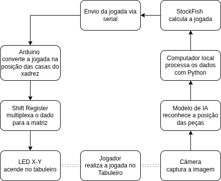

Inicialmente, tentou-se usar o Raspberry Pi para executar toda a IA diretamente no tabuleiro. No entanto, o dispositivo não apresentou desempenho suficiente para processar as imagens e realizar a inferência em tempo aceitável. Por isso, optou-se por transferir o processamento da IA para um computador externo. Essa separação se mostrou necessária, já que o microcontrolador não consegue realizar o reconhecimento com a velocidade exigida e, ao mesmo tempo, controlar os LEDs, que precisam alternar constantemente entre as casas do tabuleiro. Com isso, o Arduino passou a ser usado apenas para acionar os LEDs, tarefa para a qual é plenamente capaz.

Para facilitar o aprendizado de máquina, o tabuleiro e as peças foram construídos de forma padronizada, utilizando formas que simplifiquem o reconhecimento visual pelo sistema, no entanto, o sistema permite a utilização de peças mais comuns no mercado, evidenciando a precisão da IA. Sendo o foco do trabalho uma prova de conceito, as padronizações permitem que a IA aprenda e identifique as peças com maior precisão e menos ambiguidade, agilizando o processo de treinamento e minimizando erros de classificação.

### Tabuleiro

O tabuleiro foi montado em MDF com corte a laser conforme projeto integrador com colega Rafael Luiz Casa, que possui suporte para *webcam*, circuito impresso dos *shift-registers* conectados aos LEDs, alimentação dos componentes eletrônicos e base para a chapa de acrílico adesivada com o layout do tabuleiro de xadrez Figura  . A escolha deste material se deu por ser translúcido e visualmente agradável, permitindo a propagação uniforme da luz dos LEDs, melhorando a comunicação visual com o jogador.
    

O sistema também inclui 16 peças de xadrez em MDF, sendo os objetos principais a serem reconhecidos pela IA. Essas peças são especialmente projetadas para que o sistema de visão computacional possa identificá-las e monitorar seus movimentos durante o jogo. Com o decorrer do projeto, foi possível usar peças de xadrez reais, comumente comercializadas nos formatos conhecidos e clássicos, graças ao melhor entendimento e treinamento da IA de reconhecimento visual.

### Matriz de LEDs e Arduino

No tabuleiro de xadrez, os LEDs são dispostos em uma matriz 8x8, onde cada LED representa uma casa no tabuleiro. Após o Arduino receber a jogada via comunicação serial, o respectivo LED é acionado na respectiva casa do xadrez. Os componentes sob a base de acrílico são configurados em uma matriz de LEDs 8 x 8. Cada linha de LEDs teve seus cátodos conectados em conjunto, enquanto os ânodos de cada coluna também são conectados juntos, resultando em uma matriz de 16 conexões: 8 cátodos, um para cada linha, e 8 ânodos, um para cada coluna. Ao energizar uma linha com VCC (voltagem de corrente contínua) e conectar uma coluna ao GND (terra ou *ground*), apenas o LED na interseção correspondente acende. Esse arranjo permite o acionamento de um LED por vez, porém, para criar a ilusão de múltiplos LEDs acesos simultaneamente, cada LED é aceso individualmente por uma fração de tempo. A informação de qual par de LEDs deve ser acesso é recebida no formato de string pelo serial, no formato comum do xadrez, como por exemplo *H2H4*, sinalizando o movimento inicial do peão no tabuleiro.  

Para controlar os 64 LEDs sem ocupar 16 saídas digitais do controlador, são usados dois *CIs Shift Register 74HC595* em série. Essa configuração permite utilizar apenas três pinos do controlador para operar a matriz de LEDs. O *shift-registers* atua como um conversor serial-paralelo, onde os dados de estado para cada saída são transmitidos ao CI em formato serial, utilizando um pino para dados e outro para o clock. A cada pulso de clock, o CI desloca o estado para a saída seguinte, e a última saída do primeiro CI é conectada à entrada do segundo CI, permitindo que ambos operem em sequência. Um terceiro pino do controlador é utilizado para iniciar e finalizar a recepção de dados. Assim, o circuito integrado com oito transistores permite o controle da iluminação de cada LED, protegendo o Arduino de sobrecarga e garantindo uma iluminação estável e duradoura. A Figura  exibe o diagrama esquemático da placa, e a Figura  mostra a PCI fabricada com os componentes soldados.

% A Figura  exibe o diagrama esquemático da placa, a Figura  mostra o cabeamento entre os LEDs e a Figura  mostra a PCI fabricada, ainda com os componentes soldados.
	
	
	
	

%% 	
% 	
% 	
% 	
% 
	
	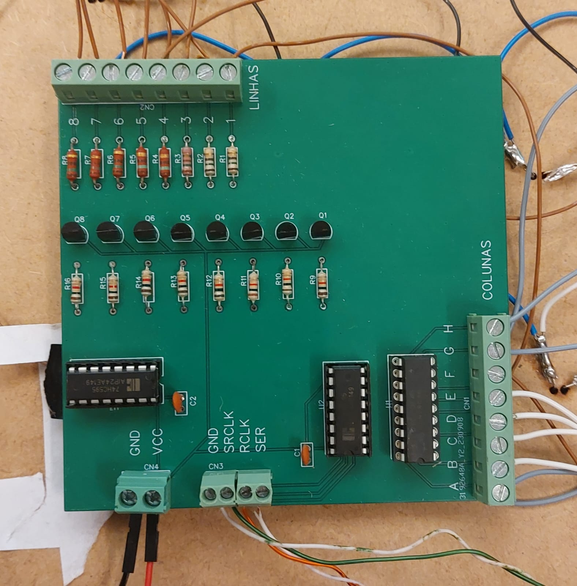
	
	

### Câmera

Enquanto as jogadas são realizadas, a *webcam* com resolução HD, é posicionada no topo do tabuleiro e conectada ao computador local, captando imagens em vídeo, ao qual são processados por um código Python . As imagens têm uma taxa de atualização correspondente ao tempo de processamento da IA, correspondendo em um *frame/rate*. Uma vez que o gargalo do sistema é o tempo de processamento da IA para reconhecer as peças, a taxa de atualização das imagens não necessita de velocidade.

### Processamento de Imagens

O sistema de controle principal utiliza um computador local que executa o processamento das imagens e cálculo das jogadas. O reconhecimento das peças é realizado mediante uma *webcam* que capta imagens do tabuleiro de xadrez. As imagens são processadas para identificar em qual casa do tabuleiro a peça está, utilizando técnicas de processamento de imagens como segmentação e correção de perspectiva. Após a captura, a imagem é enviada para o sistema de IA, implementado com o algoritmo YOLO, que identifica as posições das peças com base em um conjunto de dados criado para este propósito. Escolhido por sua capacidade de realizar detecção em alta velocidade, enquanto mantém precisão suficiente para a identificação de peças do xadrez.

As imagens capturadas das peças dispostas pelo tabuleiro são convertidas em dados, desde a análise do píxel até as coordenadas das peças. Inicialmente, o processamento de imagem se dá na aplicação de técnicas como correção de perspectiva e tratamento de cores, essa etapa é realizada por meio de código Python, ao qual capta as imagens utilizando a biblioteca OpenCV. Tais técnicas são indicadas por Szeliski, sendo essenciais para tornar mais veloz a próxima etapa de reconhecimento de peças na IA. Essas práticas de tratamento de imagem permitem que as redes neurais foquem na identificação das peças, mesmo sob condições variáveis de iluminação e ângulo, tornando o sistema mais robusto. Estas redes neurais, são condensadas em um arquivo denominado modelo.

O modelo de IA, CNN, funciona passando as imagens, e entrega os contornos das peças. Mas antes, o modelo deve ser treinado. Para treinar é necessário definir as peças e não-peças, em uma coletânea de imagens. Nesse contexto, o Roboflow foi utilizado para organizar e anotar imagens do tabuleiro de xadrez, marcando posições das peças diretamente na ferramenta. Este serviço permite ao usuário, desenvolver aplicações de *machine learning* e *deep learning* e viabiliza o uso remoto de uma GPU, para serem processados os treinamentos. Para a confecção do mesmo, foi utilizado o método YOLO, pois as redes convolucionais têm sido fundamentais para avanços em visão computacional, sendo a arquitetura preferida para modelar dados visuais devido à sua eficiência e eficácia na captura de padrões hierárquicos . 

Para atingir um modelo com alta precisão, é necessário dispor de um *dataset*, composto por imagens de treinamento devidamente anotadas com os objetos a serem identificados, como ilustrado na Figura . Conforme demonstrado na Figura , foram anotadas 112 imagens contendo um total de 3.241 objetos. Repartindo o *dataset* aleatoriamente em três grupos: 80 \% base de treinamento, 10 \% base de validação e 10 \% base de testes, obtemos o modelo final atingindo uma precisão de 99,95 \%, indicando que praticamente todas as detecções realizadas correspondiam a peças reais. A revocação (*recall*), que mede a capacidade de identificar todas as peças presentes, alcançou 97,85 \%, evidenciando uma cobertura quase completa das ocorrências reais. A métrica *mAP@50*, que avalia a precisão considerando uma sobreposição mínima de 50 \% entre a detecção e o objeto real, foi de 98,07 \%. Enquanto a *mAP@50-95*, que aplica critérios progressivamente mais rigorosos de sobreposição, atingiu 86,31 \%, evidenciado na Figura .
    

    
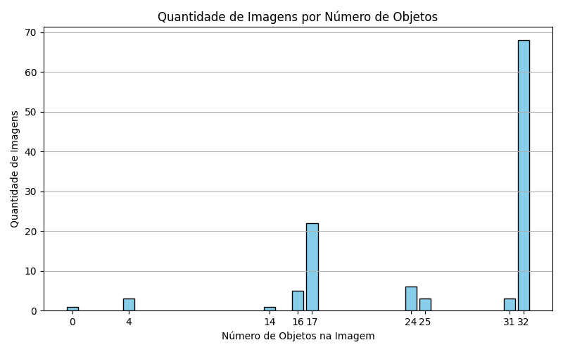

    
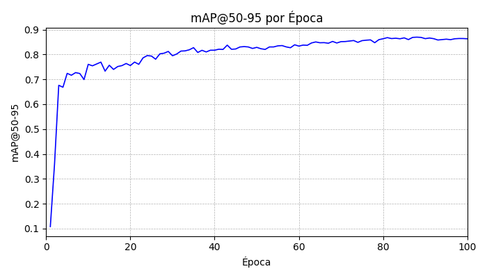

Assim que o modelo de IA revela o contorno das peças, é calculado o centroide do elemento, e mapeado na matriz do tabuleiro, para encontrar em qual posição no tabuleiro a peça se encontra. Com a posição, descrita como A1 até H8, conforme Figura  da base, é possível calcular a jogada.

### Mapeamento de jogadas

Um dos elementos mais desafiadores deste projeto foi o processo de identificação das jogadas realizadas pelo jogador. Após a detecção das peças no tabuleiro por meio da IA, determina-se quais mudanças ocorreram no estado do tabuleiro. Para isso, o sistema calcula o ponto centroide de cada peça identificada, baseado nas coordenadas fornecidas pela IA. O centroide de cada peça é mapeado para uma matriz 8x8 que representa o estado atual do tabuleiro de xadrez.

A matriz gerada reflete a posição de todas as peças no momento da jogada. Para identificar a jogada realizada, o sistema compara essa nova matriz com a matriz correspondente à interação anterior. Essa comparação permite determinar a origem (a casa de onde a peça foi retirada) e o destino (a casa para onde a peça foi movida). Essa abordagem permite uma detecção precisa das jogadas realizadas pelo jogador, mesmo em cenários com mudanças complexas no tabuleiro. 

Conforme as nomenclaturas das peças da *engine* Stockfish, as letras maiúsculas representam as peças brancas:

     $K$ - Rei Branco
     $Q$ - Rainha Branca
     $R$ - Torre Branca
     $B$ - Bispo Branco
     $N$ - Cavalo Branco
     $P$ - Peão Branco

Enquanto as minúsculas representam as peças pretas:

     $k$ - Rei Preto
     $q$ - Rainha Preta
     $r$ - Torre Preta
     $b$ - Bispo Preto
     $n$ - Cavalo Preto
     $p$ - Peão Preto

Com isso em mente, o estado inicial do tabuleiro segue a matriz A, após realizada a jogada movendo o cavalo preto "n", o estado do tabuleiro segue a matriz B. Ao subtrair as matrizes, conforme matriz R, é possível identificar o movimento da peça, e assim informar a *engine* Stockfish a leitura da jogada do usuário. Um exemplo das matrizes A, B e R é apresentada nas Eq. ,  e .

A =

r & n & b & q & k & b & n & r \\
p & p & p & p & p & p & p & p \\
0 & 0 & 0 & 0 & 0 & 0 & 0 & 0 \\
0 & 0 & 0 & 0 & 0 & 0 & 0 & 0 \\
0 & 0 & 0 & 0 & 0 & 0 & 0 & 0 \\
0 & 0 & 0 & 0 & 0 & 0 & 0 & 0 \\
P & P & P & P & P & P & P & P \\
R & N & B & Q & K & B & N & R

B =

r & 0 & b & q & k & b & n & r \\
p & p & p & p & p & p & p & p \\
n & 0 & 0 & 0 & 0 & 0 & 0 & 0 \\
0 & 0 & 0 & 0 & 0 & 0 & 0 & 0 \\
0 & 0 & 0 & 0 & 0 & 0 & 0 & 0 \\
0 & 0 & 0 & 0 & 0 & 0 & 0 & 0 \\
P & P & P & P & P & P & P & P \\
R & N & B & Q & K & B & N & R

R = A - B =

0 & n & 0 & 0 & 0 & 0 & 0 & 0 \\
0 & 0 & 0 & 0 & 0 & 0 & 0 & 0 \\
-n & 0 & 0 & 0 & 0 & 0 & 0 & 0 \\
0 & 0 & 0 & 0 & 0 & 0 & 0 & 0 \\
0 & 0 & 0 & 0 & 0 & 0 & 0 & 0 \\
0 & 0 & 0 & 0 & 0 & 0 & 0 & 0 \\
0 & 0 & 0 & 0 & 0 & 0 & 0 & 0 \\
0 & 0 & 0 & 0 & 0 & 0 & 0 & 0

Em jogadas onde uma peça captura a peça do oponente, a diferença entre as matrizes tem apenas uma posição, sendo necessário definir a cor da peça, e assim, da mesma forma anterior, compara-se a matriz das peças pretas com a matriz das peças brancas para definir a jogada.

Além de calcular as jogadas do usuário, a *engine* verifica a jogada realizada, assegurando que estejam conforme as regras do xadrez. Sempre que o usuário realiza um movimento, a *engine* valida a jogada, identificando e sinalizando qualquer irregularidade ou movimento inválido, exibido na Figura . Após a *engine* faz a jogada do oponente, calculando o movimento das peças, e sinalizando pelos LEDs. Assim que o usuário mover a peça até o LED acesso, o sistema identifica que a jogada da máquina foi concluída. E começa a ler novamente a jogada do usuário. Quaisquer não conformidades com as regras do xadrez, ou erros no reconhecimento, levantaram avisos no computador, ignorando aquela interação.
    
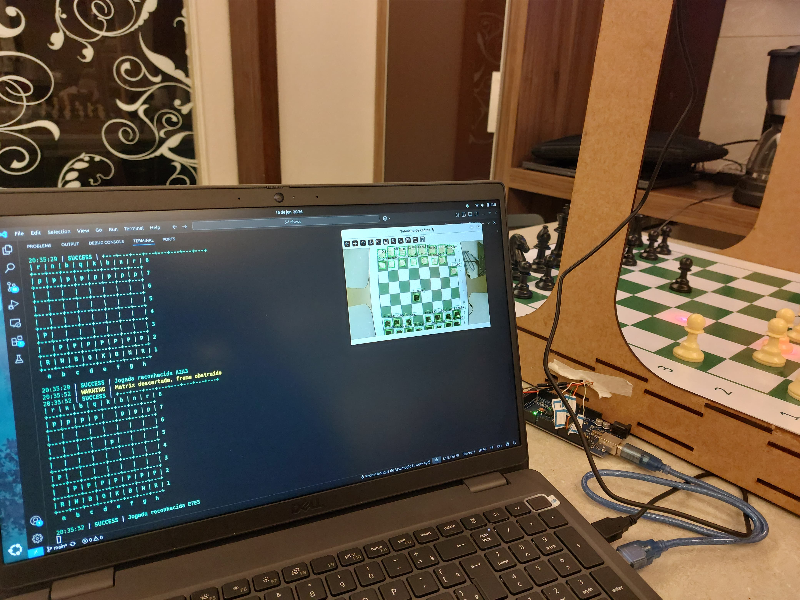

### Protótipo

O protótipo é validado por meio da realização de uma partida completa de xadrez. Com esse objetivo, os elementos convergem na montagem exposta nas Figuras  e . A primeira figura demonstra as peças utilizadas, a disposição da câmera e o LED demonstrando a jogada para capturar o peão do oponente. Enquanto a Figura  mostra o computador local, conectado com USB ao Arduino, enviando comandos.
    
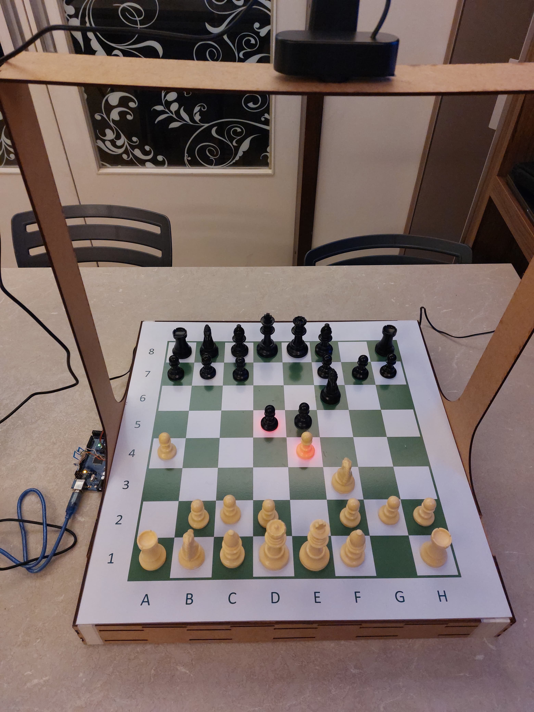

    
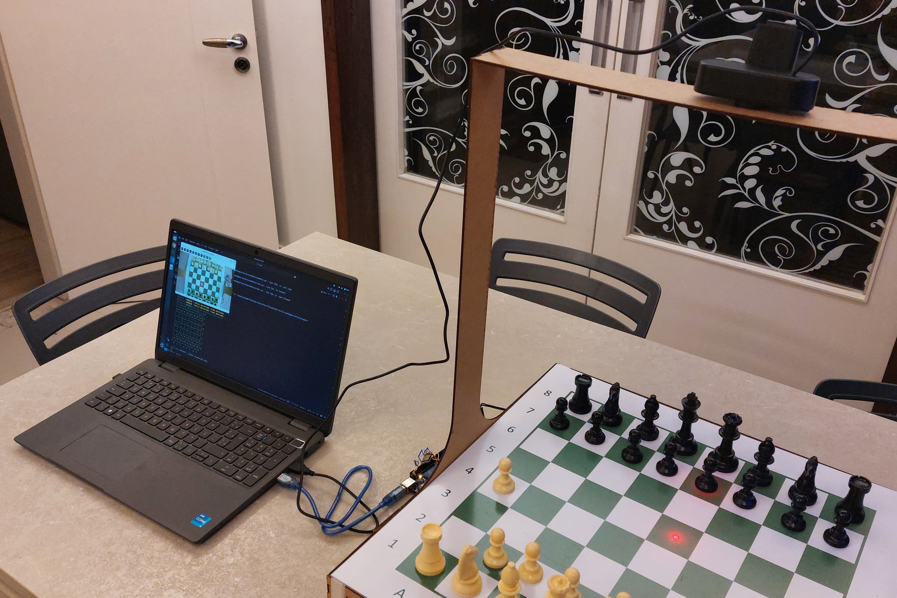

Explicitada a parte física do protótipo, a operação do sistema ao nível de software ocorre durante a execução da partida. O processo é iniciado com uma etapa de configuração inicial (*setup*) e, em seguida, entra-se em um ciclo contínuo de reconhecimento e resposta. Parâmetros como portas de comunicação, nível de dificuldade da *engine*, tempo de espera (*timeout*), entre outros, são definidos previamente por meio de um arquivo de configuração.

     **Setup Inicial**
    
         Ajusta a iluminação do ambiente por meio da calibração do índice de confiança, adaptando-o ao valor mínimo esperado para a posição inicial das peças;
         Verifica a presença e a disposição correta das 32 peças no tabuleiro;
         Confirma que todas as peças estejam visíveis e corretamente posicionadas, conforme o estado inicial padrão reconhecido pela *engine* Stockfish.
    

     **Ciclo de Reconhecimento**
    
         As peças são detectadas continuamente por visão computacional;
         A posição de cada peça é registrada em uma matriz correspondente ao estado atual do tabuleiro;
         A matriz atual é comparada com a do ciclo anterior;
         Se as matrizes forem idênticas, apresentarem variações excessivas ou inconsistência no número de peças, o ciclo é descartado, evitando falhas causadas por obstruções na captura, como a interferência da mão do jogador;
         Movimentações compatíveis com as regras do xadrez são enviadas à *engine* Stockfish para validação. Jogadas inválidas ou inacabadas (por exemplo, uma peça ainda em movimento) são ignoradas;
         Se a jogada for validada, o sistema aguarda aproximadamente 1 segundo para confirmar sua estabilidade;
         Caso a jogada persista, um comando é enviado ao Arduino;
         O Arduino aciona os LEDs nas casas indicadas pela jogada da máquina.
    

     **Reinício do Ciclo**
    
         O sistema reinicia o ciclo de análise, repetindo continuamente o processo durante toda a partida.
         A partida é encerrada quando a *engine* Stockfish determina um vencedor.
    

O código-fonte completo está disponível no repositório do projeto no GitHub, juntamente com os *scripts* de teste e os arquivos de configuração necessários para execução em outros ambientes . Visando facilitar a replicação, validação e possíveis extensões do sistema por outros pesquisadores ou profissionais da área.

### Avaliação

Ao fim do protótipo, o sistema foi validado por métodos de controle de qualidade e validação experimental, assegurando que funciona de forma precisa e confiável. Os testes de precisão mediram a eficácia do reconhecimento das peças em diferentes cenários, enquanto a coleta de dados sobre o desempenho permite a criação de indicadores de eficiência que avaliam a robustez do sistema. Essa abordagem metodológica, conforme Rosebrock, foi essencial para assegurar que o sistema funcionasse de maneira consistente, proporcionando uma experiência de alta qualidade e confirmando a eficácia da aplicação prática de visão computacional e aprendizado profundo em automação .

A avaliação da eficiência do modelo de visão computacional difere da avaliação do protótipo físico, uma vez que considera exclusivamente as imagens estáticas do tabuleiro. Por outro lado, a validação do protótipo requer a execução de partidas completas de xadrez, envolvendo interações reais que podem introduzir elementos visuais indesejáveis, como mãos, anéis, objetos estranhos e, principalmente, o movimento das peças. Esse último fator pode gerar inconsistências na sequência das jogadas interpretadas pela *engine* Stockfish, mesmo quando a visão computacional cumpre seu papel. Tais comportamentos são mitigados por meio de ajustes na programação, porém a avaliação quantitativa desses efeitos ainda é uma lacuna que deverá ser abordada em trabalhos futuros. Para isso, recomenda-se a utilização de métricas amplamente adotadas em aprendizado de máquina, como a Taxa de Falsos Positivos (FPR), a Taxa de Falsos Negativos (FNR), a Precisão, a Revocação (Recall) e o F1-Score, aplicando-as ao sistema completo, e não apenas ao reconhecimento visual isolado.

A Taxa de Falsos Positivos é definida pela Eq. :

 = }{ + }

onde \(\) representa os falsos positivos, ou seja, casas do tabuleiro erroneamente detectadas como contendo uma peça, e \(\) refere-se aos verdadeiros negativos, ou seja, casas corretamente identificadas como vazias. Essa métrica é essencial para avaliar a capacidade do modelo em evitar classificações incorretas, o que no contexto do xadrez pode gerar confusão, como considerar uma jogada em uma casa que deveria estar vazia.

Por outro lado, a Taxa de Falsos Negativos, calculada com a Eq. :

 = }{ + }

mede a proporção de casas erroneamente identificadas como vazias (\(\)), embora contenham uma peça, em relação ao total de verdadeiros positivos (\(\)), ou seja, casas corretamente identificadas como ocupadas. No contexto do xadrez, um alto \(\) indica que o sistema falhou em reconhecer peças presentes, o que pode levar à omissão de jogadas importantes.

A Precisão é uma métrica que avalia o quanto das detecções positivas realizadas pelo sistema são corretas, sendo definida pela Eq. :

 = }{ + }

No tabuleiro de xadrez, a precisão reflete a capacidade do modelo de evitar falsos positivos, assegurando que as casas detectadas como ocupadas contenham, de fato, peças.

A Revocação, por sua vez, mede a capacidade do sistema de identificar corretamente todas as peças no tabuleiro, na Eq. :

 = }{ + }

Um sistema com alta revocação é capaz de detectar mesmo peças em condições desafiadoras, como sob iluminação inadequada ou em ângulos desfavoráveis.

Por fim, o F1-Score combina a precisão e a revocação em uma métrica única, utilizando a Eq. :

 = 2    }{ + }

Essa métrica é especialmente útil quando é necessário equilibrar a capacidade do sistema de evitar falsos positivos e negativos, oferecendo uma avaliação mais robusta do desempenho geral do modelo.

No que tange o modelo de reconhecimento visual, podemos levantar através dos dados do *dataset* e do modelo gerado pelo *ultralytics* (biblioteca em Python do YOLO) as seguintes métricas de precisão e recall, evidenciadas nas Figuras  e .
    
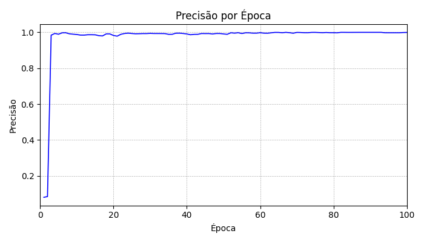

    
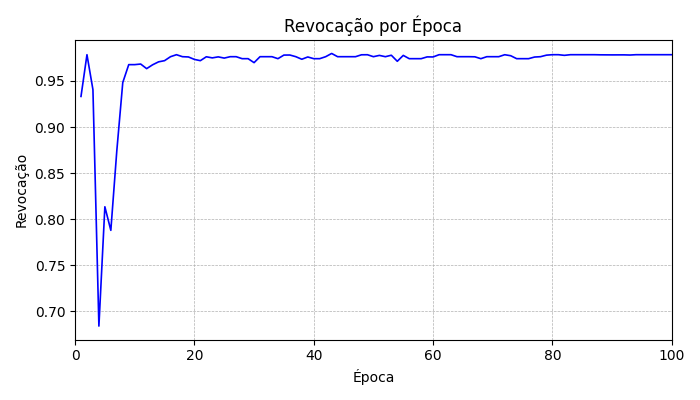

Uma métrica adicional relevante no YOLO é a *box loss*, que avalia o erro na predição da localização dos objetos, medindo a diferença entre o contorno delimitado real do objeto (ground truth) e a delimitação gerada pelo modelo. Essa métrica reflete o quão precisamente a rede consegue enquadrar os objetos detectados. 

O treinamento do modelo de IA é estruturado em épocas, que representam ciclos completos de processamento do conjunto de dados. A cada época, o modelo percorre todas as imagens do *dataset*, ajustando seus parâmetros internos visando melhorar seu desempenho. Com o avanço das épocas, observa-se uma redução gradual no erro de localização das peças, evidenciando o processo de aprendizado do modelo, mostrado na Figura .
    
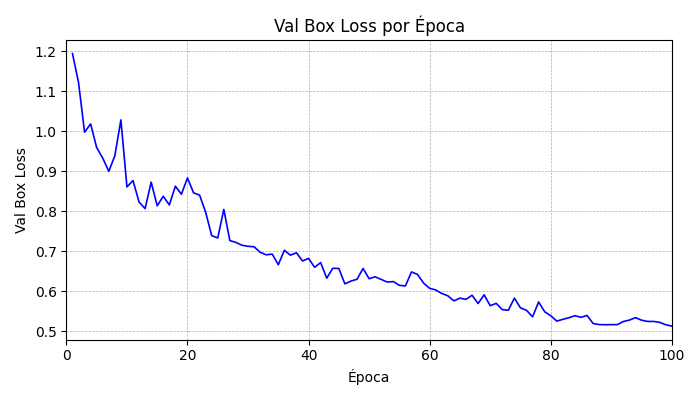

Dentro do contexto de reconhecimento de imagem, foi aplicada a técnica de validação cruzada *k-fold* com divisão em três partes (k=3). Em cada rodada, dois grupos foram usados para treino e um para validação. Isso permitiu avaliar o desempenho do modelo YOLO de forma mais robusta, garantindo que todos os dados fossem utilizados em diferentes combinações de treino e validação. O gráfico da Figura  apresenta os resultados individuais de cada partição, além da média das métricas, permitindo uma comparação entre as execuções.
    
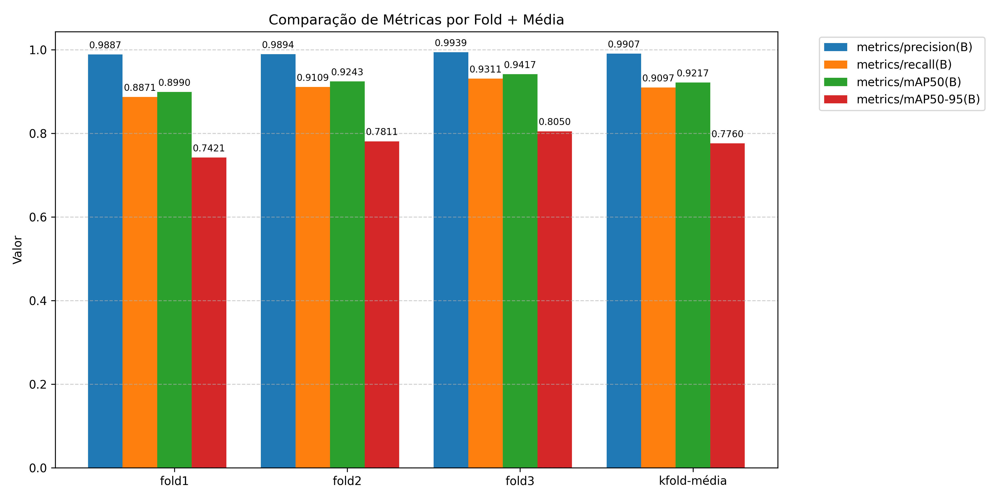

Essas métricas fornecem uma base quantitativa para ajustar e validar o sistema de reconhecimento de peças de xadrez, assegurando que ele opere com alta precisão e confiabilidade. Além disso, as métricas ajudam a identificar os pontos fracos do modelo, permitindo ajustes direcionados que maximizem sua eficiência e aplicabilidade.

### Melhorias e correções

% #TODO...Trabalhos futuros, de repente agrupar com conclusão
Para aprimorar o sistema automatizado de tabuleiro de xadrez, propõe-se o uso de algoritmos de pré-processamento de imagem para melhorar a precisão do reconhecimento em condições variadas de iluminação e ângulos de visão. Além disso, a integração de aprendizado online pode permitir a adaptação a novos estilos de peças e tabuleiros. No entanto, a dependência de um computador externo permanece devido ao alto consumo de GPU exigido pelo modelo de IA atual. Para eliminar essa necessidade, seria fundamental reduzir o peso computacional da IA, otimizando sua eficiência para rodar diretamente em um microcontrolador.

Do ponto de vista estrutural, a manutenção do tabuleiro e a coleta de imagens podem ser aprimoradas visando aumentar a durabilidade e a praticidade do sistema. Sugere-se, por exemplo, o desenvolvimento de uma estrutura modular que permita a substituição facilitada de LEDs danificados ou de peças físicas obsoletas. Além disso, a implementação de um suporte removível para a webcam pode tornar o transporte e o armazenamento do protótipo mais seguros e eficientes.

Em relação ao processamento das jogadas, observa-se que a *engine* Stockfish apresenta desempenho robusto e confiável, não exigindo ajustes significativos. No entanto, a interface homem-máquina pode ser otimizada por meio da incorporação de um display LCD, responsável por exibir mensagens de alerta, registros do sistema e outras informações relevantes ao usuário. Esta adição tem o potencial de eliminar a necessidade de um computador auxiliar, conferindo maior autonomia e portabilidade ao protótipo.

## Conclusões

O projeto desenvolvido resultou em um tabuleiro de xadrez automatizado funcional, capaz de reconhecer peças por meio de visão computacional e processar jogadas. A proposta se destaca por proporcionar uma experiência física e interativa, substituindo interfaces digitais convencionais por um sistema concreto. Essa abordagem explora novas formas de interação homem-máquina, aproximando conceitos de automação no cotidiano e tornando a tecnologia mais tangível e visual.

A arquitetura do sistema foi planejada para garantir a eficácia na condução das partidas de xadrez. A precisão na identificação das peças e na detecção de jogadas comprova a viabilidade da integração entre algoritmos de aprendizado de máquina e sensores visuais, validando a aplicação de soluções inteligentes em ambientes físicos, sem a necessidade de interfaces complexas ou modificações estruturais no cenário monitorado.

Na engenharia, o trabalho apresenta relevância ao unir aquisição de dados, processamento inteligente, controle de atuadores e construção de interface. Sendo utilizado o xadrez, como contexto para evidenciar conceitos teóricos em prática, trabalhando com restrições de projeto e avaliação de eficácia. Tais conceitos podem ser expandidos e aplicados em diversos processos industriais, como inspeção de qualidade, logística de peças, e controle de produção.

Por último, abre-se espaço para novas integrações entre hardware e software em outros contextos, como: educação técnica, desenvolvimento de sistemas acessíveis, robótica, e novas formas de interação entre homem e máquina. Utilizando este projeto como inspiração e como base sólida para futuras pesquisas que combinem visão computacional, aprendizado de máquina e automação física, com foco em adaptabilidade e precisão.